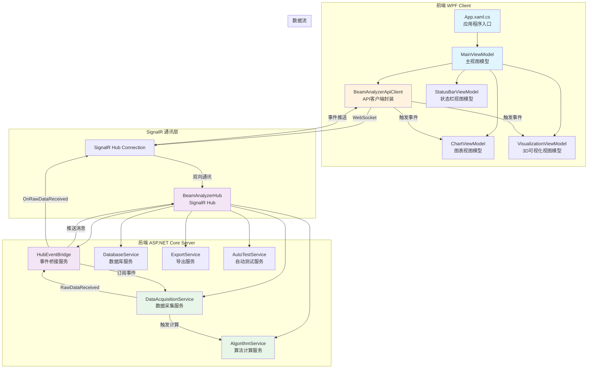
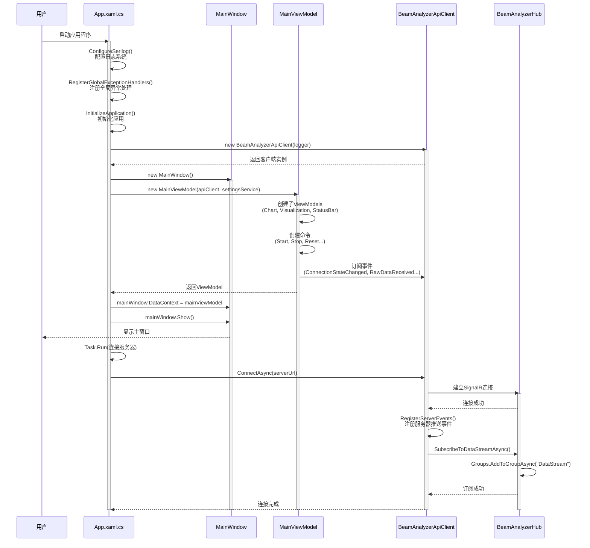
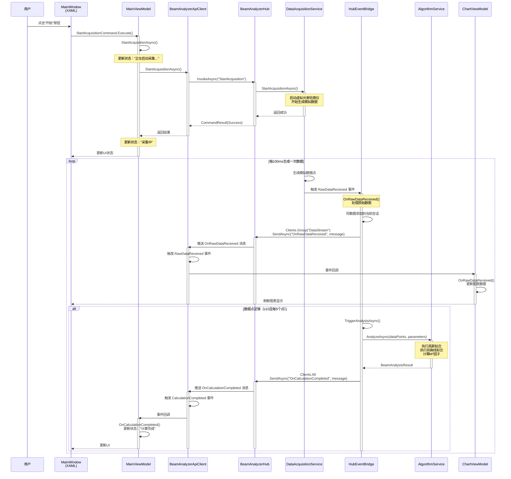
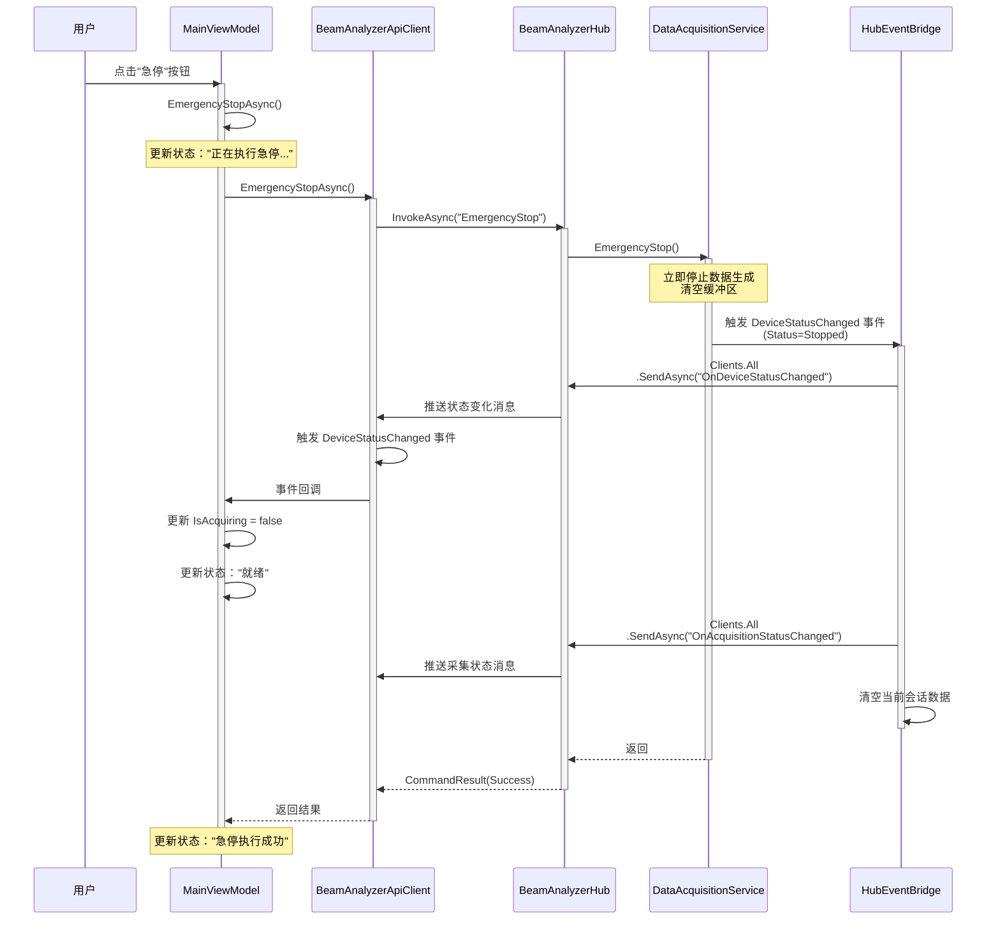

# 光束质量分析系统 - 前后端通讯架构

## 架构概览

本系统采用 **前后端分离架构**，通过 **SignalR** 实现实时双向通讯。后端基于 ASP.NET Core 8.0，前端基于 WPF + MVVM 架构。



## 详细调用链

### 1. 应用程序启动流程



**关键代码位置：**

1. **App.xaml.cs::InitializeApplication()**
   - 文件：`BeamQualityAnalyzer.Frontend/src/BeamQualityAnalyzer.WpfClient/App.xaml.cs`
   - 行：约 60-120
   - 功能：创建 API 客户端、主窗口、ViewModel，建立连接

2. **BeamAnalyzerApiClient::ConnectAsync()**
   - 文件：`BeamQualityAnalyzer.Frontend/src/BeamQualityAnalyzer.ApiClient/BeamAnalyzerApiClient.cs`
   - 行：约 40-70
   - 功能：创建 HubConnection，注册事件，启动连接

3. **BeamAnalyzerHub::OnConnectedAsync()**
   - 文件：`BeamQualityAnalyzer.Backend/src/BeamQualityAnalyzer.Server/Hubs/BeamAnalyzerHub.cs`
   - 行：约 380-385
   - 功能：记录客户端连接日志

---

### 2. 数据采集流程（完整调用链）



**关键代码位置：**

1. **MainViewModel::StartAcquisitionAsync()**
   - 文件：`BeamQualityAnalyzer.Frontend/src/BeamQualityAnalyzer.WpfClient/ViewModels/MainViewModel.cs`
   - 行：约 220-240
   - 功能：调用 API 客户端启动采集，更新 UI 状态

2. **BeamAnalyzerApiClient::StartAcquisitionAsync()**
   - 文件：`BeamQualityAnalyzer.Frontend/src/BeamQualityAnalyzer.ApiClient/BeamAnalyzerApiClient.cs`
   - 行：约 90-95
   - 功能：通过 SignalR 调用服务器方法

3. **BeamAnalyzerHub::StartAcquisition()**
   - 文件：`BeamQualityAnalyzer.Backend/src/BeamQualityAnalyzer.Server/Hubs/BeamAnalyzerHub.cs`
   - 行：约 45-60
   - 功能：调用数据采集服务，返回命令结果

4. **HubEventBridge::OnRawDataReceived()**
   - 文件：`BeamQualityAnalyzer.Backend/src/BeamQualityAnalyzer.Server/Services/HubEventBridge.cs`
   - 行：约 70-120
   - 功能：接收数据采集事件，推送到客户端，触发算法计算

5. **HubEventBridge::TriggerAnalysisAsync()**
   - 文件：`BeamQualityAnalyzer.Backend/src/BeamQualityAnalyzer.Server/Services/HubEventBridge.cs`
   - 行：约 150-230
   - 功能：执行算法分析，推送计算结果

6. **ChartViewModel::OnRawDataReceived()**
   - 文件：`BeamQualityAnalyzer.Frontend/src/BeamQualityAnalyzer.WpfClient/ViewModels/ChartViewModel.cs`
   - 功能：接收原始数据，更新图表显示

---

### 3. 停止采集流程



**关键代码位置：**

1. **MainViewModel::EmergencyStopAsync()**
   - 文件：`BeamQualityAnalyzer.Frontend/src/BeamQualityAnalyzer.WpfClient/ViewModels/MainViewModel.cs`
   - 行：约 250-270
   - 功能：调用 API 客户端执行急停

2. **BeamAnalyzerHub::EmergencyStop()**
   - 文件：`BeamQualityAnalyzer.Backend/src/BeamQualityAnalyzer.Server/Hubs/BeamAnalyzerHub.cs`
   - 行：约 80-95
   - 功能：调用数据采集服务急停

3. **HubEventBridge::OnDeviceStatusChanged()**
   - 文件：`BeamQualityAnalyzer.Backend/src/BeamQualityAnalyzer.Server/Services/HubEventBridge.cs`
   - 行：约 125-160
   - 功能：处理设备状态变化，推送到客户端，清空会话数据

---

## 核心组件说明

### 前端组件

#### 1. App.xaml.cs（应用程序入口）
- **职责**：应用程序生命周期管理、全局异常处理、日志配置
- **关键方法**：
  - `ConfigureSerilog()`：配置 Serilog 日志系统
  - `InitializeApplication()`：创建 API 客户端、主窗口、ViewModel
  - `RegisterGlobalExceptionHandlers()`：注册全局异常处理器

#### 2. MainViewModel（主视图模型）
- **职责**：管理整个应用程序的业务逻辑和状态
- **关键属性**：
  - `IsAcquiring`：是否正在采集
  - `IsConnected`：是否已连接到服务器
  - `CurrentStatus`：当前状态文本
- **关键命令**：
  - `StartAcquisitionCommand`：启动数据采集
  - `EmergencyStopCommand`：急停
  - `ResetMotorCommand`：设备复位
  - `OpenSettingsCommand`：打开设置对话框

#### 3. BeamAnalyzerApiClient（API 客户端）
- **职责**：封装 SignalR 通讯，提供类型安全的 API 调用接口
- **关键方法**：
  - `ConnectAsync()`：建立 SignalR 连接
  - `StartAcquisitionAsync()`：启动数据采集
  - `SubscribeToDataStreamAsync()`：订阅数据流
  - `RegisterServerEvents()`：注册服务器推送事件
- **关键事件**：
  - `RawDataReceived`：原始数据接收事件
  - `CalculationCompleted`：计算完成事件
  - `ConnectionStateChanged`：连接状态变化事件

#### 4. ChartViewModel（图表视图模型）
- **职责**：管理 2D 图表数据和显示
- **关键方法**：
  - `OnRawDataReceived()`：接收原始数据，更新图表
  - `OnCalculationCompleted()`：接收计算结果，更新拟合曲线

### 后端组件

#### 1. BeamAnalyzerHub（SignalR Hub）
- **职责**：提供客户端与服务器之间的双向实时通信接口
- **关键方法**：
  - `StartAcquisition()`：启动数据采集
  - `EmergencyStop()`：急停
  - `SubscribeToDataStream()`：订阅数据流
  - `OnConnectedAsync()`：客户端连接处理
  - `OnDisconnectedAsync()`：客户端断开处理

#### 2. HubEventBridge（事件桥接服务）
- **职责**：将服务层事件转发到 SignalR Hub，实现服务器到客户端的实时推送
- **关键方法**：
  - `OnRawDataReceived()`：处理原始数据接收事件，推送到客户端
  - `OnDeviceStatusChanged()`：处理设备状态变化事件
  - `TriggerAnalysisAsync()`：触发算法分析，推送计算结果
- **生命周期**：
  - `StartAsync()`：订阅服务层事件
  - `StopAsync()`：取消订阅事件

#### 3. DataAcquisitionService（数据采集服务）
- **职责**：管理数据采集流程，生成模拟数据
- **关键事件**：
  - `RawDataReceived`：原始数据接收事件
  - `DeviceStatusChanged`：设备状态变化事件

#### 4. AlgorithmService（算法计算服务）
- **职责**：执行光束质量算法计算
- **关键方法**：
  - `AnalyzeAsync()`：执行高斯拟合、双曲线拟合、M² 计算

---

## 消息类型

### 客户端 → 服务器（命令）

| 方法名 | 参数 | 返回值 | 说明 |
|--------|------|--------|------|
| `StartAcquisition` | 无 | `CommandResult` | 启动数据采集 |
| `StopAcquisition` | 无 | `CommandResult` | 停止数据采集 |
| `EmergencyStop` | 无 | `CommandResult` | 急停 |
| `ResetDevice` | 无 | `CommandResult` | 设备复位 |
| `SubscribeToDataStream` | 无 | 无 | 订阅数据流 |
| `StartAutoTest` | `AutoTestConfigurationDto` | `CommandResult` | 启动自动测试 |

### 服务器 → 客户端（推送）

| 事件名 | 消息类型 | 说明 |
|--------|----------|------|
| `OnRawDataReceived` | `RawDataReceivedMessage` | 原始数据接收 |
| `OnCalculationCompleted` | `CalculationCompletedMessage` | 计算完成 |
| `OnDeviceStatusChanged` | `DeviceStatusMessage` | 设备状态变化 |
| `OnAcquisitionStatusChanged` | `AcquisitionStatusMessage` | 采集状态变化 |
| `OnErrorOccurred` | `ErrorMessage` | 错误发生 |
| `OnProgressUpdated` | `ProgressMessage` | 进度更新 |

---

## 数据流向

### 1. 原始数据流

```
DataAcquisitionService (生成数据)
    ↓ RawDataReceived 事件
HubEventBridge (接收事件)
    ↓ 构造 RawDataReceivedMessage
SignalR Hub (推送消息)
    ↓ OnRawDataReceived
BeamAnalyzerApiClient (接收推送)
    ↓ 触发 RawDataReceived 事件
ChartViewModel (订阅事件)
    ↓ 更新图表数据
UI (显示图表)
```

### 2. 计算结果流

```
HubEventBridge (触发计算)
    ↓ 调用 AlgorithmService
AlgorithmService (执行计算)
    ↓ 返回 BeamAnalysisResult
HubEventBridge (构造消息)
    ↓ 推送 OnCalculationCompleted
SignalR Hub
    ↓
BeamAnalyzerApiClient
    ↓ 触发 CalculationCompleted 事件
MainViewModel / ChartViewModel
    ↓ 更新 UI
UI (显示计算结果)
```

---

## 关键设计模式

### 1. MVVM 模式（前端）
- **Model**：数据模型（DTO）
- **View**：XAML 视图
- **ViewModel**：视图模型（MainViewModel, ChartViewModel 等）
- **优势**：UI 与业务逻辑分离，便于测试和维护

### 2. 事件驱动架构（后端）
- **事件发布者**：DataAcquisitionService
- **事件订阅者**：HubEventBridge
- **事件总线**：C# 事件机制
- **优势**：松耦合，易于扩展

### 3. 桥接模式（HubEventBridge）
- **抽象层**：SignalR Hub
- **实现层**：服务层（DataAcquisitionService, AlgorithmService）
- **桥接**：HubEventBridge 连接两者
- **优势**：服务层不依赖 SignalR，可独立测试

### 4. 命令模式（前端命令）
- **命令**：IAsyncRelayCommand
- **接收者**：API 客户端
- **调用者**：ViewModel
- **优势**：命令可撤销、可记录、可排队

---

## 线程模型

### 前端线程
1. **UI 线程**：处理 UI 更新、用户交互
2. **SignalR 接收线程**：接收服务器推送消息
3. **后台线程**：执行耗时操作（Task.Run）

**线程切换规则**：
- API 调用在后台线程执行（`Task.Run`）
- UI 更新必须在 UI 线程执行（`Dispatcher.Invoke`）
- SignalR 事件回调自动切换到 UI 线程

### 后端线程
1. **SignalR 线程池**：处理客户端请求
2. **后台服务线程**：HubEventBridge, DataAcquisitionService
3. **算法计算线程**：AlgorithmService

**线程安全**：
- HubEventBridge 使用 `lock` 保护共享数据
- SignalR Hub 方法是线程安全的

---

## 错误处理

### 前端错误处理
1. **全局异常处理器**：捕获未处理异常，记录日志，显示友好错误对话框
2. **命令异常处理**：每个命令方法都有 try-catch，更新状态栏显示错误
3. **连接异常处理**：自动重连机制，显示连接状态

### 后端错误处理
1. **Hub 方法异常**：返回 `CommandResult.FailureResult`
2. **事件处理异常**：记录日志，推送错误消息到客户端
3. **服务层异常**：向上传播，由 Hub 或 HubEventBridge 处理

---

## 性能优化

### 前端优化
1. **数据降采样**：图表数据过多时自动降采样
2. **UI 虚拟化**：列表控件使用虚拟化
3. **异步操作**：所有耗时操作使用 async/await
4. **事件节流**：高频事件使用节流机制

### 后端优化
1. **数据批量推送**：原始数据批量推送，减少消息数量
2. **计算节流**：每 5 个数据点计算一次，避免过度计算
3. **连接池**：数据库连接池
4. **异步 I/O**：所有 I/O 操作使用异步

---

## 总结

本系统通过 SignalR 实现了高效的实时双向通讯，采用事件驱动架构和 MVVM 模式，实现了前后端的松耦合。HubEventBridge 作为关键的桥接组件，连接了服务层和通讯层，使得服务层可以独立于 SignalR 进行开发和测试。

**核心优势**：
- ✅ 实时性：WebSocket 长连接，毫秒级延迟
- ✅ 可扩展性：事件驱动架构，易于添加新功能
- ✅ 可测试性：MVVM 和服务层分离，便于单元测试
- ✅ 可维护性：清晰的分层架构，职责明确
