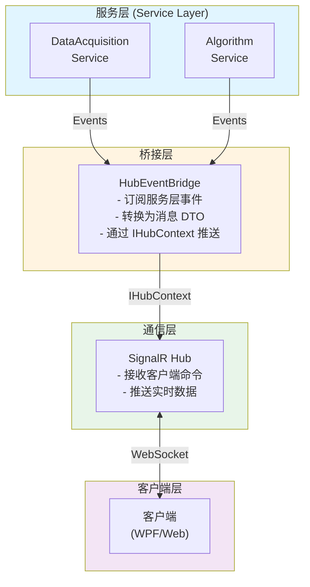
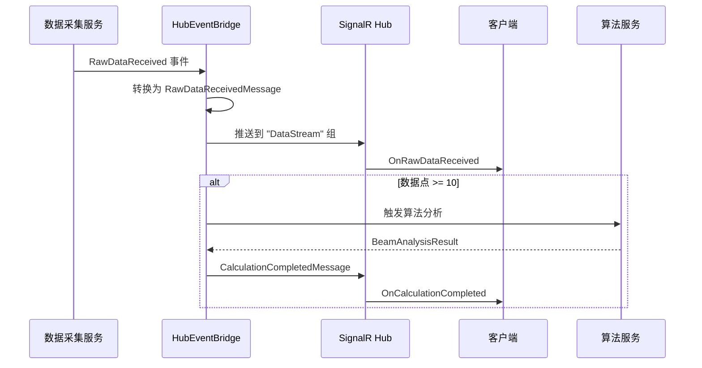
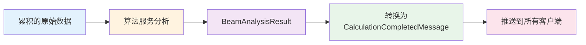
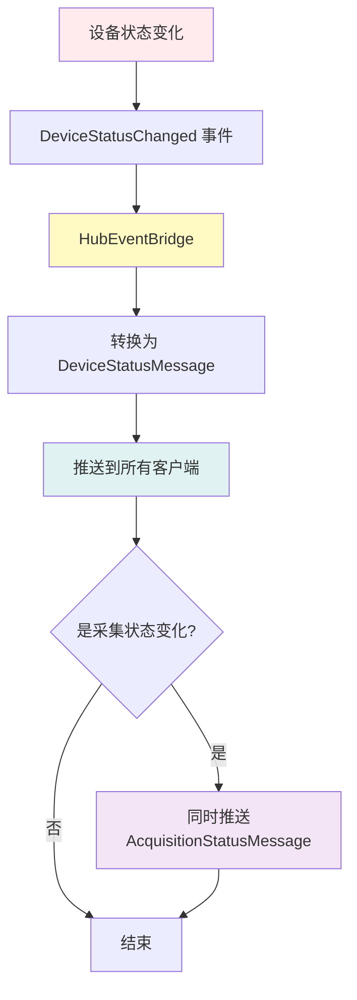

# Hub 事件桥接服务文档

## 概述

`HubEventBridge` 是一个后台服务（Hosted Service），负责将服务层的事件转发到 SignalR Hub，实现服务器到客户端的实时数据推送。

## 架构设计



## 核心功能

### 1. 事件订阅

在服务启动时（`StartAsync`），桥接服务订阅以下事件：

- `IDataAcquisitionService.RawDataReceived` - 原始数据接收事件
- `IDataAcquisitionService.DeviceStatusChanged` - 设备状态变化事件

### 2. 数据流处理

#### 原始数据流



#### 算法计算流



#### 状态变化流



### 3. 消息类型

桥接服务推送以下类型的消息到客户端：

| 消息类型 | 推送方法 | 目标客户端 | 触发条件 |
|---------|---------|-----------|---------|
| `RawDataReceivedMessage` | `OnRawDataReceived` | DataStream 组 | 接收到原始数据 |
| `CalculationCompletedMessage` | `OnCalculationCompleted` | 所有客户端 | 算法计算完成 |
| `DeviceStatusMessage` | `OnDeviceStatusChanged` | 所有客户端 | 设备状态变化 |
| `AcquisitionStatusMessage` | `OnAcquisitionStatusChanged` | 所有客户端 | 采集状态变化 |
| `ErrorMessage` | `OnErrorOccurred` | 所有客户端 | 发生错误 |
| `ProgressMessage` | `OnProgressUpdated` | 所有客户端 | 操作进度更新 |

## 使用方式

### 服务注册

在 `Program.cs` 中注册为 Hosted Service：

```csharp
builder.Services.AddHostedService<HubEventBridge>();
```

### 客户端订阅

客户端需要先订阅数据流组：

```csharp
await hubConnection.InvokeAsync("SubscribeToDataStream");
```

然后注册事件处理器：

```csharp
hubConnection.On<RawDataReceivedMessage>("OnRawDataReceived", message =>
{
    // 处理原始数据
});

hubConnection.On<CalculationCompletedMessage>("OnCalculationCompleted", message =>
{
    // 处理计算结果
});

hubConnection.On<DeviceStatusMessage>("OnDeviceStatusChanged", message =>
{
    // 处理设备状态变化
});
```

## 性能优化

### 1. 数据流节流

原始数据以 10Hz 频率推送，但算法计算采用节流策略：

- 至少累积 10 个数据点才触发计算
- 每 5 个新数据点触发一次计算
- 避免过度计算影响性能

### 2. 异步处理

所有事件处理都是异步的，不会阻塞服务层：

```csharp
private async void OnRawDataReceived(object? sender, RawDataReceivedEventArgs e)
{
    // 异步处理，不阻塞数据采集
}
```

### 3. 错误隔离

事件处理中的错误不会影响服务层：

```csharp
try
{
    // 处理事件
}
catch (Exception ex)
{
    _logger.LogError(ex, "处理事件时发生错误");
    await BroadcastErrorAsync("错误标题", ex.Message);
}
```

## 测试

### 单元测试

`HubEventBridgeTests.cs` 包含以下测试：

1. `StartAsync_ShouldSubscribeToServiceEvents` - 验证事件订阅
2. `StopAsync_ShouldUnsubscribeFromServiceEvents` - 验证事件取消订阅
3. `OnDeviceStatusChanged_ShouldBroadcastToAllClients` - 验证状态广播
4. `OnRawDataReceived_WithEnoughData_ShouldTriggerAnalysis` - 验证算法触发

### 集成测试

`EndToEndDataFlowTests.cs` 包含端到端测试：

1. `DataFlow_FromAcquisitionToHub_ShouldBeComplete` - 验证完整数据流
2. `EmergencyStop_ShouldImmediatelyStopDataFlow` - 验证急停功能

## 验证的需求

此实现验证了以下需求：

- **需求 16.2**: 数据采集服务通过事件发布原始数据 ✅
- **需求 16.3**: 算法服务订阅原始数据事件并执行计算 ✅
- **需求 16.4**: 算法服务通过事件发布计算结果 ✅
- **需求 16.5**: UI 层订阅计算结果事件并更新视图模型 ✅（客户端实现）

## 未来扩展

1. **可视化数据推送**: 添加 2D/3D 可视化数据的推送
2. **日志消息推送**: 实时推送日志消息到客户端
3. **进度跟踪**: 更详细的操作进度跟踪
4. **性能监控**: 添加性能指标推送（CPU、内存、网络等）
